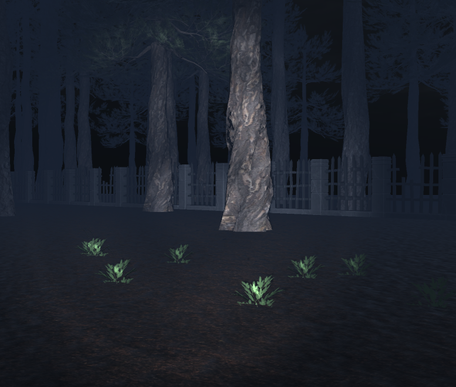
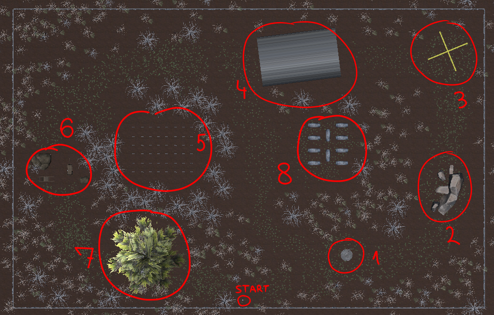
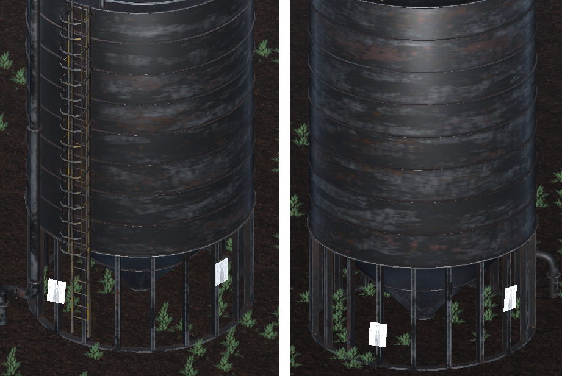

# SlenderVR

A clone of "Slender: the 8 pages" for Google Cardboard.
Made with Unity and Cardboard SDK for Unity.

View a demo [here](./Docs/vid.mp4).

## Getting started

1. Unity Engine is required. Download unity [here](https://unity.com/download). The project was built with version 2022.3.50f1.
2. Clone this repository.
3. Import the project from Unity Hub.
4. The game can be played from the Unity Editor using your mouse.
5. Alternatively, a pre-built Android binary can be downloaded from [releases](https://github.com/magley/slender-vr/releases).

## Showcase

The map consists of 8 locations in a forest.

Each location will have a paper nearby at one of four pre-defined locations, selected randomly.
For example, the picture below shows paper placements at the silo (marked as `1` on the map). 

The game is meant to be playable with Google Cardboard.

All interaction is handled by looking:
- you move by looking at the ground
- looking closer to your feet makes you run
- papers are collected by looking at them for a short period of time

## Contributing

Contributions are welcome. The following is an incomplete list of potential improvements:
- Slenderman can clip through all objects
- All papers in the level share the same texture
- No win clause after collecting all pages
- Improve Slenderman's AI
- Improve condition for seeing Slenderman and taking "damage"

## License

This project source code and documentation is licensed under the [BSD 2-Clause License](https://github.com/magley/slender-vr/blob/main/LICENSE).

All images, graphics, and other non-code resources, created specifically for this project, are licensed under [CC 0](https://creativecommons.org/public-domain/cc0/). 

All 3rd-party assets and libraries used in this project retain all rights under their respective licenses.